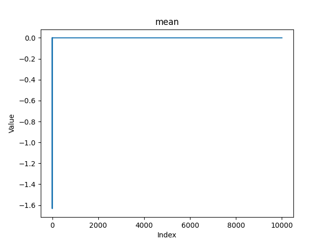
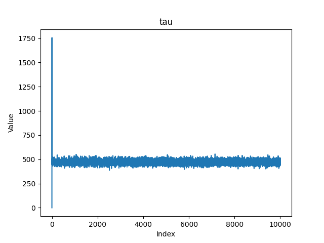
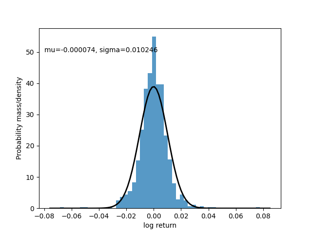
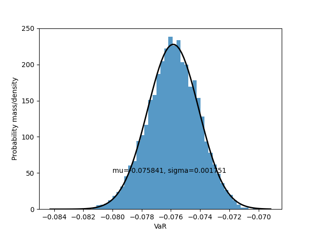

# Data collection and analysis

This doc gives the comprehensive process of data collection and analysis of this project.

The project is implemented with Python. The source code can be found at: 

[ToothlessOS/Bayesian-inference-project: Hand-on project for STATS211 @DKU with resources](https://github.com/ToothlessOS/Bayesian-inference-project)

## Part 1: Data source and preprocessing

The daily closing price of Shanghai Stock Exchange (SSE) is obtained through akshare([akfamily/akshare: AKShare is an elegant and simple financial data interface library for Python, built for human beings! 开源财经数据接口库](https://github.com/akfamily/akshare)), a popular open source project that provides easy-to-use APIs for fiancial data. We collect the daily closing price from 2021.1.1 to 2024.11.24 (n = 942).

With this data, we compute the daily log return (n = 941), which is the most important reference of an index.

> For this section, check /src/main.py & /src/utils/dataloader.py

## Part 2: Data analysis

> Reference: [7.3 Gibbs Sampler | Advanced Statistical Computing](https://bookdown.org/rdpeng/advstatcomp/gibbs-sampler.html)

We assume that the daily log return follows a normal distribution with unknown mean $\mu$ and unknown precision $\tau$ . We adopt Bayesian inference.

The detailed procedure of the data analysis goes as follows:

1. Set up the suitable priors for $\mu$ and $\tau$ respectively

2. With the help of gibbs sampler, generate samples from the posteriors (updated from the priors with the collected daily return data) for $\mu$ and $\tau$ respectively.

3. Each pair of $(\mu, \tau)$ defines a distribution of daily log return. For each distribution, the Value-at-Risk (VaR) and Expected Shortfall (ES) can be computed - these two are commonly used indicators of risk.

4. We end up with collections of VaR and ES data points respectively. Now we can fit each of them with a normal distribution, giving us the point estimator and the confidence intervals for VaR and ES of SSE.

Below is the elaboration on each section:

### 2.1 Prior setup

$$
\mu \sim \mathcal{N}\left(0, w^{-1}\right)
\newline
\tau \sim \operatorname{Gamma}(\alpha, \beta)
\newline
\mathbf{y}: dataset
$$

In our example, we set up **vague priors**, reflecting a lack of specific prior knowledge about the long returns of the SSE index. Specifically, we choose $\alpha = 1, \beta = 0.001$ for the Gamma distribution, which give us a large variance, in other words "vague" (recall that the variance of a gamma is $\alpha / \beta^2$). As for the normal distribution, we choose a mean of 0 and a low precision of 0.001.

> Check /src/main.py: 13 for the parameters and tweak them yourself!

### 2.2 Bayesian inference, gibbs sampler and validation

In Gibbs sampling we have to compute two full conditional distributions:

And generate the chain iteratively given initial values:

$$
\tau_{n+1} = \operatorname{Gamma}\left(\alpha+\frac{n}{2}, \beta+\frac{1}{2} \sum\left(y_{i}-\mu_{n}\right)^{2}\right)
\newline
\mu_{n+1} = \mathcal{N}\left(\frac{\tau_{n}}{n \tau_{n}+w} \sum y_{i}, \frac{1}{n \tau_{n}+w}\right)
$$

> Check /src/utils/modeller.py for the implementation of Gibbs Sampler

The idea is that the Markov chain has the stationary distribution - which is the distribution that we want to sample from.

Here's a glimpse of the dataset generated, the convergence looks good:

In our case, we run 10,000 trials and remove the first 1,000 trials as burn-in.

By calculating Auto-Correlation Function (ACF) on the chain, we find that correlation quickly converges to 0 with lag >= 2. This suggests that each sample can be treated as independent. Hence, these samples should be valid.)

### 2.3 Computation of VaR and ES

With each point in the sample of $(\mu, \tau)$, a distribution of log return can be generated. Based on the distribution, we can compute VaR and ES. The following are the results:

### 2.4 Fitting of VaR and ES

Now, we can fit our sample of VaR and ES with a normal distribution, the results are as follow:

